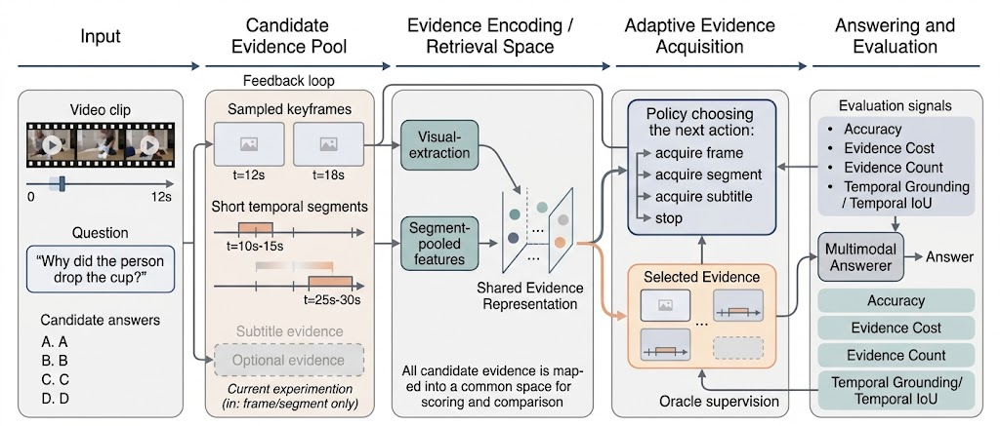

# Adaptive Evidence Acquisition for Grounded VideoQA

This repository implements a grounded VideoQA pipeline for studying adaptive visual evidence acquisition. Instead of answering every question from a fixed number of frames or clips, the system builds a candidate pool of keyframes and short temporal segments, selects a compact evidence set, and then answers with a frozen vision-language model.

The central question is whether a VideoQA system can reduce visual evidence cost while preserving answer accuracy and temporal grounding quality.

## Research Artifacts

- Report: `docs/report/final_paper.pdf`
- Presentation: `docs/presentation/research_presentation.pptx`
- Demo input/output: `demo/README.md`

## Pipeline



The pipeline has four stages:

1. Normalize VideoQA annotations into a shared schema.
2. Construct a visual evidence pool from frames and short temporal segments.
3. Select evidence with fixed, learned, temporal-supervised, or oracle selectors.
4. Answer with Qwen2.5-VL and evaluate answer accuracy, cost, and temporal grounding.

## Main Result

The reported NExT-GQA test results use Qwen2.5-VL-3B-Instruct as the answerer on 5,553 examples. `MLP+NMS` is the proposed learned selector.

| Method | Acc@QA | Cost | Count | mIoP | IoP@0.5 | mIoU | IoU@0.5 | Acc@GQA |
| --- | --- | --- | --- | --- | --- | --- | --- | --- |
| Qwen one segment | `0.668` | `1.500` | `1.000` | `0.301` | `0.311` | `0.165` | `0.133` | `0.221` |
| Qwen MLP+NMS | `0.689` | `2.935` | `2.000` | `0.440` | `0.453` | `0.246` | `0.210` | `0.321` |
| Qwen temporal-supervised router | `0.696` | `2.273` | `2.000` | `0.433` | `0.432` | `0.088` | `0.075` | `0.312` |
| Qwen oracle top-2 | `0.701` | `2.493` | `2.000` | `0.618` | `0.615` | `0.224` | `0.207` | `0.442` |
| Qwen fixed 3 frames + 3 segments | `0.724` | `7.500` | `6.000` | `0.618` | `0.615` | `0.296` | `0.287` | `0.454` |

The main finding is an accuracy-cost-grounding tradeoff. `MLP+NMS` improves grounded answer accuracy over the one-segment control at less than half the cost of the fixed 3+3 reference. Oracle top-2 shows that compact supporting evidence often exists in the candidate pool, leaving routing quality as the main bottleneck.

## Method Components

- `One segment`: low-cost control that selects the highest-scoring segment.
- `Linear policy`: sequential learned policy trained from oracle traces.
- `MLP router`: lightweight candidate scorer over frozen visual/question features.
- `MLP+NMS`: MLP router with temporal non-maximum suppression to reduce redundant selections.
- `Temporal-supervised router`: diagnostic selector trained from temporal overlap labels.
- `Oracle top-k`: non-deployable upper-bound selector using ground-truth temporal overlap.
- `Fixed 3+3`: high-cost reference using three frames and three segments.

## Repository Layout

```text
assets/                     Figures used by the README
configs/                    Experiment configuration templates
demo/                       Sample input/output artifact
docs/                       Final report and presentation
scripts/                    Preprocessing, training, evaluation, and analysis entry points
src/adaptive_evidence_vqa/  Python package
tests/                      Unit and integration tests
```

Package modules:

```text
data/       Dataset schemas, normalization, candidate pools, and visual artifacts
retrieval/  Lexical, BM25, and hybrid CLIP retrieval utilities
models/     Answerers, oracle construction, policies, and evidence routers
eval/       Accuracy, grounding, sufficiency, and aggregation metrics
```

Large local artifacts are intentionally excluded from version control:

```text
data/       Raw datasets and downloaded videos
runs/       Full experiment outputs, frame caches, predictions, and metrics
outputs/    Small local/debug outputs
```

## Installation

Create the Conda environment:

```bash
conda env create -f environment.yml
conda activate adaptive-evidence-vqa
```

Update an existing environment:

```bash
conda env update -f environment.yml --prune
conda activate adaptive-evidence-vqa
```

The package is installed in editable mode through `environment.yml`. To install manually:

```bash
pip install -e ".[dev,vision,train]"
```

Run the tests:

```bash
python -m pytest
```

Run a minimal toy pipeline:

```bash
python -m adaptive_evidence_vqa toy-run
```

Print the default configuration:

```bash
python -m adaptive_evidence_vqa print-config
```

## Dataset Setup

The main experiments use NExT-GQA annotations and videos. This repository does not include raw videos or credentials. If using a gated Hugging Face mirror, provide `HF_TOKEN` in a local `.env` file or export it in the shell. Do not commit `.env`.

Expected local layout:

```text
data/nextgqa_hf/
  train.csv
  val.csv
  test.csv
  gsub_*.json
  frame2time_*.json or upbd_*.json
  map_vid_vidorID.json
  NExTVideo/<group>/<video_id>.mp4
```

Equivalent paths from the official NExT-GQA release or private storage can be supplied through script arguments.

## Common Commands

Normalize NExT-GQA annotations:

```bash
python scripts/prepare_nextgqa.py \
  --qa-path /path/to/nextgqa/val.csv \
  --gsub-path /path/to/nextgqa/gsub_val.json \
  --frame-times-path /path/to/nextgqa/frame2time_val.json \
  --video-map-path /path/to/nextgqa/map_vid_vidorID.json \
  --output-path data/normalized/nextgqa_val.jsonl
```

Build a candidate pool:

```bash
python scripts/build_candidate_pool.py \
  --input-path data/normalized/nextgqa_val.jsonl \
  --output-path data/candidates/nextgqa_val_candidates.jsonl
```

Materialize frame and segment evidence:

```bash
python scripts/materialize_visual_evidence.py \
  --input-path data/candidates/nextgqa_val_candidates.jsonl \
  --video-root data/nextgqa_hf/NExTVideo \
  --output-path data/candidates/nextgqa_val_visual.jsonl \
  --frames-dir data/artifacts/frames \
  --segments-dir data/artifacts/segments \
  --extract-segments
```

Extract CLIP features:

```bash
python scripts/extract_clip_features.py \
  --input-path data/candidates/nextgqa_val_visual.jsonl \
  --output-path data/candidates/nextgqa_val_visual_features.jsonl \
  --feature-dir data/features/clip
```

Run Qwen follow-up evaluations:

```bash
export PYTHONPATH=src:.
export PYTORCH_CUDA_ALLOC_CONF=expandable_segments:True
bash scripts/run_qwen_followup_strengthening.sh test
bash scripts/run_qwen_temporal_router.sh test
```

Run the single-GPU research wrapper:

```bash
bash scripts/run_research_single_gpu.sh
```

Run the full-data cache wrapper:

```bash
bash scripts/run_nextgqa_full_single_gpu.sh
```

All full-data runners write to `runs/` by default and use resumable JSONL outputs.

## Evaluation Metrics

- `Acc@QA`: multiple-choice answer accuracy.
- `Cost`: average acquired evidence cost.
- `Count`: average number of selected evidence items.
- `mIoP`: mean intersection over prediction between selected evidence and ground-truth support.
- `IoP@0.5`: fraction of examples with evidence IoP at least 0.5.
- `mIoU`: mean temporal intersection over union.
- `IoU@0.5`: fraction of examples with temporal IoU at least 0.5.
- `Acc@GQA`: answer accuracy gated by temporal grounding success.

## External References

This repository is an independent implementation. The following projects are used as references for datasets, preprocessing conventions, or baseline context:

- TVQA: <https://github.com/jayleicn/TVQA>
- TVQA+ / STAGE: <https://github.com/jayleicn/TVQAplus>
- FrozenBiLM: <https://github.com/antoyang/FrozenBiLM>
